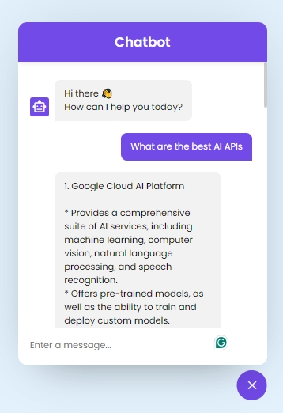

# Chatbot in JavaScript

This project demonstrates a simple and interactive chatbot built using HTML, CSS, and JavaScript. The aim was to create a chatbot interface capable of sending and receiving messages, interacting with an API to generate responses, and providing a sleek, user-friendly design.



## Table of Contents

- [Features](#features)
- [Installation](#installation)
- [Usage](#usage)
- [Customization](#customization)
- [API Integration](#api-integration)
- [Get Your API Key](#get-your-api-key)

## Features

- User-friendly chatbot interface
- Responsive design for both mobile and desktop
- API integration for generating responses
- Smooth animations and transitions
- Accessible and semantic HTML structure

## Installation

To get started with this project, follow these steps:

1. **Clone the repository:**
    ```sh
    git clone https://github.com/wonderakwei/Smart-Chatbot-with-JavaScript-and-Google-API.git
    ```
2. **Navigate to the project directory:**
    ```sh
    cd Smart-Chatbot-with-JavaScript-and-Google-API
    ```
3. **Open `index.html` in your web browser:**

    Double-click the `index.html` file, or open it with your preferred web server.

## Usage

1. **Toggle the Chatbot:**
   - Click the chat icon button at the bottom-right corner to open the chatbot.
   - Click the close button or the chat icon again to close the chatbot.

2. **Send a Message:**
   - Type your message in the textarea at the bottom of the chatbot.
   - Press the Enter key or click the send button to send your message.

3. **Receive a Response:**
   - The chatbot will respond to your message using the integrated API.

## Customization

### HTML

The HTML structure was organized for readability and accessibility. The content and structure in the `index.html` file can be updated as needed.

### CSS

Styles were defined in the `style.css` file. The appearance of the chatbot can be customized by modifying the CSS classes and properties.

### JavaScript

The main functionality was implemented in the `script.js` file. The JavaScript code can be extended or modified to add new features or change the behavior of the chatbot.

## API Integration

To integrate with the API:

1. Obtain your API key from the service provider.
2. Update the `API_KEY` variable in the `script.js` file with your API key:
    ```javascript
    const API_KEY = "your-api-key-here";
    ```
3. The chatbot will then use the specified API to generate responses.

## Get Your API Key

To obtain your API key for integrating the chatbot with Google’s Gemini API:

1. Go to [Google AI Studio](https://aistudio.google.com/app/apikey).
2. Navigate to the API key section and create a new API key.

**Note:** The API is free but has a limited number of usage requests.
